# Sleep-Health-Analysis 睡眠品質分析


### 分析結果顯示，影響睡眠品質的三大關鍵因素為：睡眠時長、壓力程度和心率，且三者間存在互相影響的關係。另外分析結果也顯示睡眠品質會影響壓力程度。
---

## 資料來源

資料集來自 Kaggle 公開資料集 **Sleep Health and Lifestyle Dataset**，**共 13 個欄位、374 筆樣本**。


### 變量說明

|     | 欄位名稱                | 說明                  |
| --- | ----------------------- | --------------------- |
| 1   | Person ID               | 人員 ID               |
| 2   | Gender                  | 性別（Male / Female） |
| 3   | Age                     | 年齡                  |
| 4   | Occupation              | 職業                  |
| 5   | Sleep Duration          | 每日睡眠時數          |
| 6   | Quality of Sleep        | 睡眠品質（1–10）      |
| 7   | Physical Activity Level | 每日身體活動程度      |
| 8   | Stress Level            | 壓力程度（1–10）      |
| 9   | BMI Category            | BMI 類別              |
| 10  | Blood Pressure          | 血壓（收縮壓/舒張壓） |
| 11  | Heart Rate              | 心率                  |
| 12  | Daily Steps             | 每日步數              |
| 13  | Sleep Disorder          | 睡眠障礙              |

```python
import pandas as pd
import numpy as np
import matplotlib.pyplot as plt
import seaborn as sns
from sklearn.ensemble import RandomForestRegressor

rawdata = pd.read_csv('Sleep_health_and_lifestyle_dataset.csv',thousands=',')
```

## 觀察數據：單變量敘述統計

```python
rawdata.info()
```

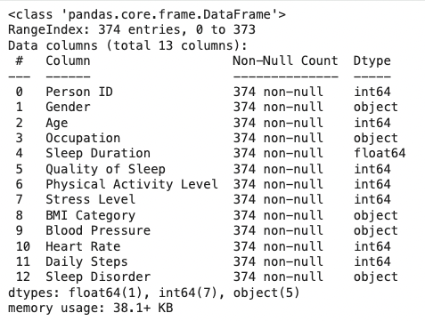


```pyton
rawdata.describe().T
```

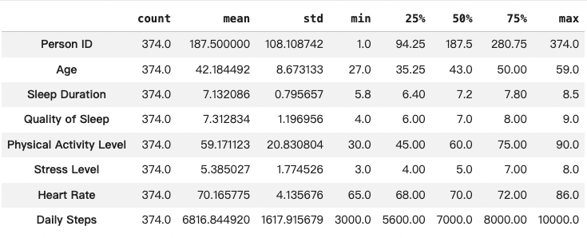


```python
num_col=['Age','Sleep Duration','Quality of Sleep', 'Physical Activity Level', 'Stress Level','Heart Rate', 'Daily Steps','Blood Pressure']

fig, axs = plt.subplots(4, 2, figsize=(15, 20))
plt.subplots_adjust(wspace=0.8, hspace=0.8)

for i, j in enumerate(num_col):
    sns.histplot(rawdata[j], bins=10, color='lightblue', ax=axs[int(i/2), i%2], edgecolor='black')
    for p in axs[int(i/2), i%2].patches:
        axs[int(i/2), i%2].annotate(format(p.get_height(), '.0f'),
                                     (p.get_x() + p.get_width() / 2., p.get_height()),
                                     ha = 'center', va = 'center',
                                     xytext = (0, 10),
                                     textcoords = 'offset points')
plt.tight_layout()
plt.show()
```

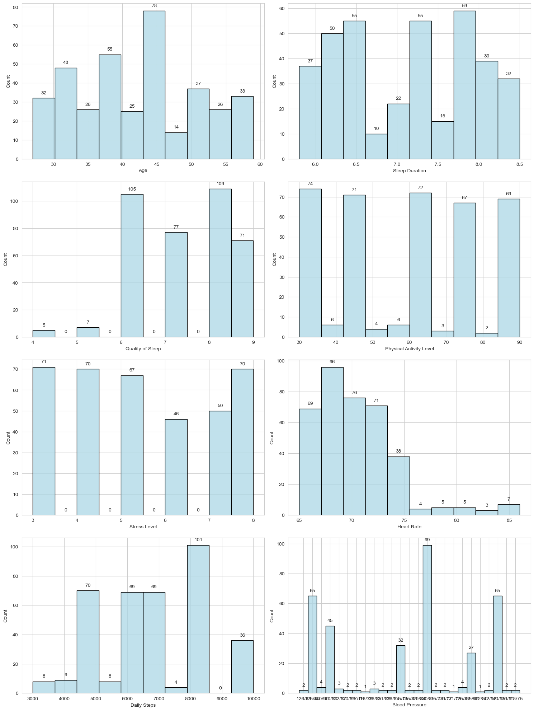


```python
categorical = ['Gender', 'Occupation', 'BMI Category', 'Sleep Disorder']

fig, axs = plt.subplots(2, 2, figsize=(10, 10))
plt.subplots_adjust(wspace=0.25, hspace=1)

for i, cat in enumerate(categorical):
    sns.countplot(x=cat, data=rawdata, color='lightblue', ax=axs[int(i/2), i%2],edgecolor='black')
    for p in axs[int(i/2), i%2].patches:
        axs[int(i/2), i%2].annotate(format(p.get_height(), '.0f'),
                                     (p.get_x() + p.get_width() / 2., p.get_height()),
                                     ha = 'center', va = 'center',
                                     xytext = (0, 10),
                                     textcoords = 'offset points')
    axs[int(i/2), i%2].set_ylabel("")
    axs[int(i/2), i%2].set_xlabel(cat)
    axs[int(i/2), i%2].tick_params(axis='x', rotation=45)

for ax in axs.flat:
    for label in ax.get_xticklabels():
        label.set_rotation(45)
        label.set_ha('right')

plt.tight_layout()
plt.show()
```

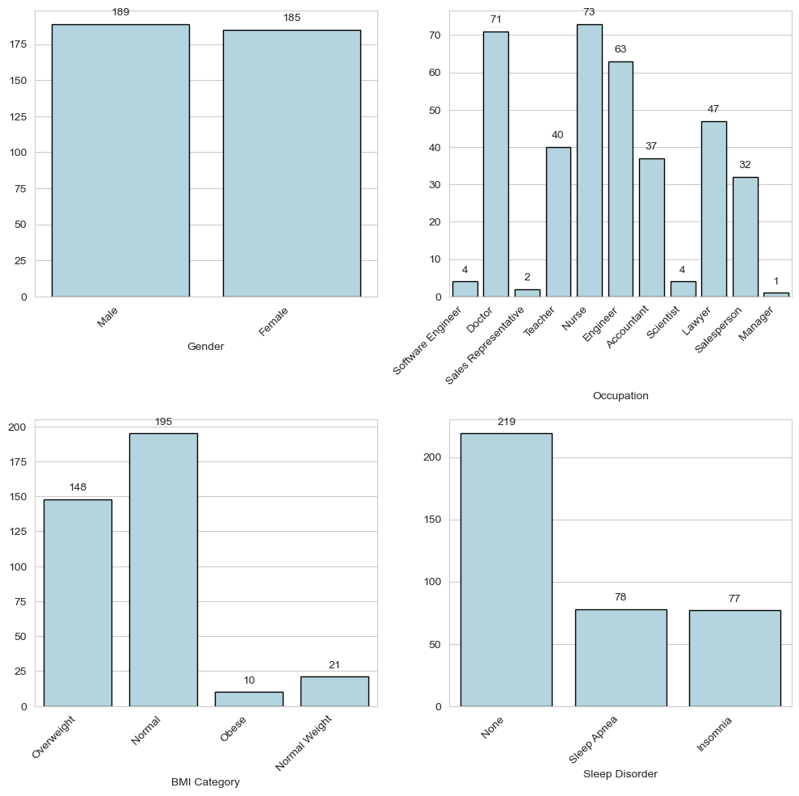


## 數據預處理

1. **檢查無缺漏值、無重複紀錄。**
2. **數據格式化：確保數據遵循一致的格式和標準。**
3. **數據離散化：將連續數據轉換為分類數據，提高模型的解釋性。**
4. **類別重編碼：將部分類別合併成一類，避免稀疏數據問題。**

```python
dataset = rawdata.copy()
# 欄位重命名
dataset.rename(columns={'Sleep Duration':'Sleep_Duration',
                    'Quality of Sleep':'Sleep_Quality',
                    'Physical Activity Level':'Physical_Activity_Level',
                    'Stress Level':'Stress_Level',
                    'BMI Category':'BMI_Category',
                    'Blood Pressure':'Blood_Pressure',
                    'Heart Rate':'Heart_Rate',
                    'Daily Steps':'Daily_Steps',
                    'Sleep Disorder':'Sleep_Disorder'}, inplace=True)
```

```python
dataset['BMI_Category'] = np.where(dataset['BMI_Category']=='Normal Weight', 'Normal', dataset['BMI_Category'])
```

```python
dataset['Sleep_Disorder'] = np.where(dataset['Sleep_Disorder'].isnull(), 'Normal', dataset['Sleep_Disorder'])
```

```python
dataset['Systolic'] = dataset['Blood_Pressure'].str.split('/').str[0].astype(int)
dataset['Diastolic'] = dataset['Blood_Pressure'].str.split('/').str[1].astype(int)

def bp_category(systolic, diastolic):
    if systolic < 120 and diastolic < 80:
        return 'Optimal'
    elif 120 <= systolic < 140 and diastolic < 90:
        return 'Normal'
    elif systolic >= 140 and diastolic >= 90 or diastolic >= 80:
        return 'Hypertension'

dataset['BP_Category'] = dataset.apply(lambda row: bp_category(row['Systolic'], row['Diastolic']), axis=1)
```

```python
def ds_group(daliy_steps):
    if daliy_steps < 5000:
        return '<5000'
    elif 5000<= daliy_steps < 7500:
        return '5000~7499'
    elif 7500<= daliy_steps < 10000:
        return '7500~9999'
    else:
        return '>=10000'

dataset['Daily_Steps_Group'] = dataset.apply(lambda row: ds_group(row['Daily_Steps']), axis=1)
```

```python
def pa_group(activity):
    if 30 <= activity < 50:
        return 'Low Intensity'
    elif 50 <= activity < 80:
        return 'Moderate Intensity'
    elif 80 <= activity < 100:
        return 'High Intensity'
    else:
        return 'High Intensity'

dataset['Physical_Activity_Group'] = dataset.apply(lambda row: pa_group(row['Physical_Activity_Level']), axis=1)
```

```python
def sq_group(quality):
    if quality in (4, 5):
        return '1'
    elif quality in (6, 7):
        return '2'
    else:
        return '3'

dataset['Sleep_Quality_Group'] = dataset.apply(lambda row: sq_group(row['Sleep_Quality']), axis=1)

dataset['Sleep_Quality'] = dataset['Sleep_Quality_Group']
```

```python
def sd_group(duration):
    if duration <= 6.0:
        return '~6'
    elif duration <= 6.5:
        return '6-6.5'
    elif duration <= 7.0:
        return '6.5-7'
    elif duration <= 7.5:
        return '7-7.5'
    elif duration <= 8.0:
        return '7.5-8'
    else:
        return '8~'

dataset['Sleep_Duration_Group'] = dataset.apply(lambda row: sd_group(row['Sleep_Duration']), axis=1)
```

```python
def hr_group(rate):
    if rate <= 70:
        return '~70'
    elif rate <= 75:
        return '70-75'
    elif rate <= 80:
        return '75-80'
    elif rate <= 85:
        return '80-85'
    else:
        return '85~'

dataset['Heart_Rate_Group'] = dataset.apply(lambda row: hr_group(row['Heart_Rate']), axis=1)
```

```python
def sl_group(level):
    if level <= 3:
        return '1'
    elif level <= 4:
        return '2'
    elif level <= 5:
        return '3'
    elif level <= 6:
        return '4'
    elif level <= 7:
        return '5'
    else:
        return '6'

dataset['Stress_Level_Group'] = dataset.apply(lambda row: sl_group(row['Stress_Level']), axis=1)

print(dataset[['Stress_Level', 'Stress_Level_Group']])
```

```python
recode_dict = {
    'Doctor': 'Medical',
    'Nurse': 'Medical',
    'Sales Representative': 'Sales',
    'Salesperson': 'Sales',
    'Scientist': 'Engineer',
    'Software Engineer': 'Engineer',
    'Engineer': 'Engineer',
    'Teacher': 'Other',
    'Accountant': 'Other',
    'Lawyer': 'Other',
    'Manager': 'Other'
}

dataset['Occupation'] = dataset['Occupation'].replace(recode_dict)
dataset['Occupation'].value_counts()
```

```python
dataset.drop(columns=['Blood_Pressure', 'Systolic', 'Diastolic', 'Daily_Steps', 'Physical_Activity_Level', 'Sleep_Quality_Group'], axis=1, inplace=True)
```


## 數據探索

```python
dataset.info()
```

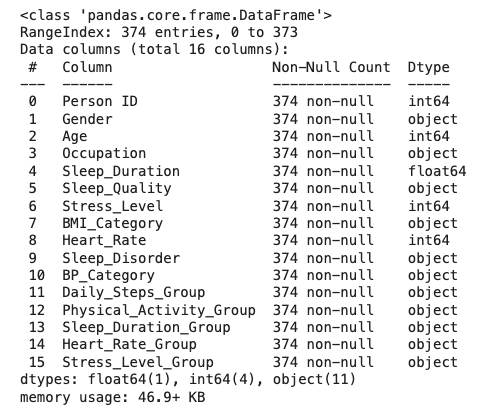


```python
dataset.describe()
```

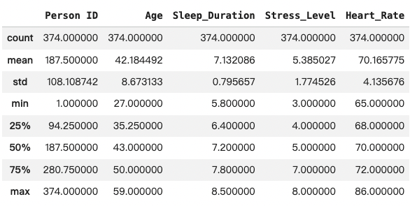


```python
num_col = ['Age', 'Sleep_Duration', 'Stress_Level', 'Heart_Rate']

fig, axs = plt.subplots(2, 2, figsize=(15, 10))
plt.subplots_adjust(wspace=0.8, hspace=0.8)

for i, col in enumerate(num_col):
    row = i // 2
    col_pos = i % 2
    sns.histplot(dataset[col], bins=10, color='lightblue', ax=axs[row, col_pos], edgecolor='black')
    for p in axs[row, col_pos].patches:
        axs[row, col_pos].annotate(format(p.get_height(), '.0f'),
                                   (p.get_x() + p.get_width() / 2., p.get_height()),
                                   ha='center', va='center',
                                   xytext=(0, 10),
                                   textcoords='offset points')

plt.tight_layout()
plt.show()
```

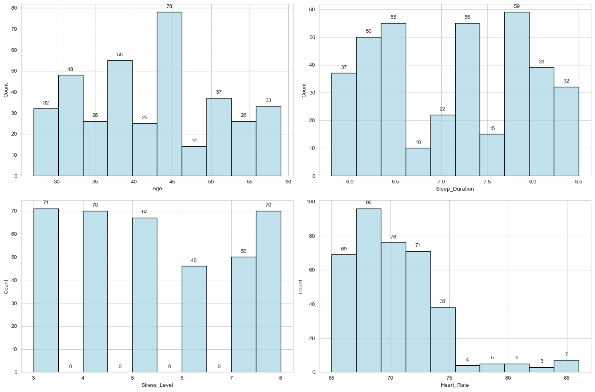


```python
from pandas.api.types import CategoricalDtype

# 定義順序型類別的順序
bmi_order = CategoricalDtype(['Normal', 'Overweight', 'Obese'], ordered=True)
steps_order = CategoricalDtype(['<5000', '5000~7499', '7500~9999', '>=10000'], ordered=True)
activity_order = CategoricalDtype(['Low Intensity', 'Moderate Intensity', 'High Intensity'], ordered=True)
blook_pressure_order = CategoricalDtype(['Optimal', 'Normal', 'Hypertension'], ordered=True)
sleep_quality_order = CategoricalDtype(['1', '2', '3'], ordered=True)

# 將列轉換為順序型類別
dataset['BMI_Category'] = dataset['BMI_Category'].astype(bmi_order)
dataset['Daily_Steps_Group'] = dataset['Daily_Steps_Group'].astype(steps_order)
dataset['Physical_Activity_Group'] = dataset['Physical_Activity_Group'].astype(activity_order)
dataset['BP_Category'] = dataset['BP_Category'].astype(blook_pressure_order)
dataset['Sleep_Quality'] = dataset['Sleep_Quality'].astype(sleep_quality_order)
```

```python
categorical = ['Gender', 'Occupation', 'BMI_Category', 'Daily_Steps_Group', 'Physical_Activity_Group', 'BP_Category', 'Sleep_Disorder', 'Sleep_Quality']

fig, axs = plt.subplots(2, 4, figsize=(20, 10))
plt.subplots_adjust(wspace=0.4, hspace=0.6)

for i, cat in enumerate(categorical):
    row = i // 4
    col = i % 4
    sns.countplot(x=cat, data=dataset, color='lightblue', ax=axs[row, col], edgecolor='black',
                  order=dataset[cat].cat.categories if dataset[cat].dtype.name == 'category' else None)
    for p in axs[row, col].patches:
        axs[row, col].annotate(format(p.get_height(), '.0f'),
                               (p.get_x() + p.get_width() / 2., p.get_height()),
                               ha='center', va='center',
                               xytext=(0, 10),
                               textcoords='offset points')
    axs[row, col].set_ylabel("")
    axs[row, col].set_xlabel(cat)
    axs[row, col].tick_params(axis='x', rotation=45)

for j in range(len(categorical), 8):
    fig.delaxes(axs[1, j % 4])

plt.tight_layout()
plt.show()
```

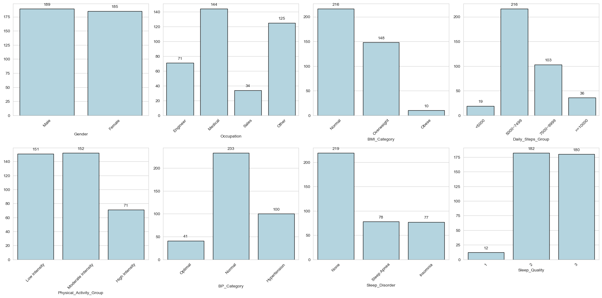


### 對類別型數據編碼

```python
from sklearn import preprocessing

label_encoder = preprocessing.LabelEncoder()
# categorical = ['Gender', 'Occupation', 'BMI_Category', 'Daily_Steps_Group', 'Physical_Activity_Group', 'BP_Category', 'Sleep_Disorder', 'Sleep_Quality']

encode_dataset = dataset.copy()
encode_dataset['Gender'] = label_encoder.fit_transform(encode_dataset['Gender'])
encode_dataset['Occupation'] = label_encoder.fit_transform(encode_dataset['Occupation'])
encode_dataset['BMI_Category'] = label_encoder.fit_transform(encode_dataset['BMI_Category'])
encode_dataset['Daily_Steps_Group'] = label_encoder.fit_transform(encode_dataset['Daily_Steps_Group'])
encode_dataset['Physical_Activity_Group'] = label_encoder.fit_transform(encode_dataset['Physical_Activity_Group'])
encode_dataset['BP_Category'] = label_encoder.fit_transform(encode_dataset['BP_Category'])
encode_dataset['Sleep_Disorder'] = label_encoder.fit_transform(encode_dataset['Sleep_Disorder'])
encode_dataset['Sleep_Quality'] = label_encoder.fit_transform(encode_dataset['Sleep_Quality'])
encode_dataset['Sleep_Duration_Group'] = label_encoder.fit_transform(encode_dataset['Sleep_Duration_Group'])
encode_dataset['Heart_Rate_Group'] = label_encoder.fit_transform(encode_dataset['Heart_Rate_Group'])
encode_dataset['Stress_Level_Group'] = label_encoder.fit_transform(encode_dataset['Stress_Level_Group'])

encode_dataset.drop(columns=['Heart_Rate', 'Sleep_Duration', 'Stress_Level'], axis=1, inplace=True)
```

## 相關性分析

```python
dataset_without_id = encode_dataset.drop(columns=['Person ID'])

correlation_matrix = dataset_without_id.corr()

plt.figure(figsize=(16, 8))
sns.heatmap(correlation_matrix, annot=True, cmap='coolwarm')
plt.title('Correlation Matrix')
plt.xticks(rotation=30)
plt.show()
```

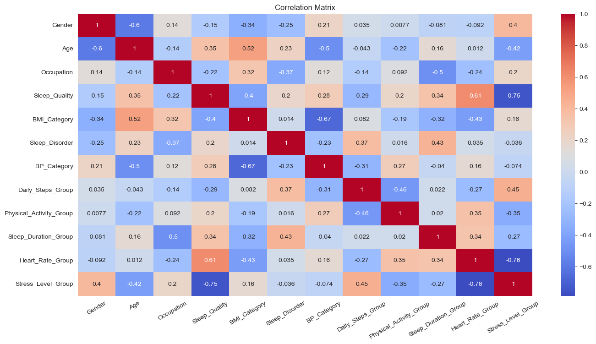


從相關係數矩陣中發現與 Sleep Quality 相關係數絕對值較⼤的前六個變量，從⼤到⼩分別是 Stress Level、Sleep Duration、Heart Rate、BMI Category、Age、Daily Steps Group。其中 Sleep Duration 與 Sleep Quality 呈強烈正相關。

## 多變量敘述統計

已知 Sleep Duration 與 Sleep Quality 強烈正相關，因此針對另外五個變量 Stress Level、Heart Rate、BMI Category、Age、Daily Steps Group 做多變量敘述統計。

```python
sns.set_style("whitegrid")

sns.jointplot(data=dataset, x="Age", y="Stress_Level", hue="Sleep_Quality", palette="viridis", height=5, s=50)
plt.suptitle('Stress Level and Age by Sleep Quality', fontsize=14, fontweight='bold', y=1.02)
plt.xlabel('Age', fontsize=12)
plt.ylabel('Stress Level', fontsize=12)
plt.show()

sns.jointplot(data=dataset, x="Heart_Rate", y="Stress_Level", hue="Sleep_Quality", palette="viridis", height=5, s=50)
plt.suptitle('Stress Level and Heart Rate by Sleep Quality', fontsize=14, fontweight='bold', y=1.02)
plt.xlabel('Heart Rate', fontsize=12)
plt.ylabel('Stress Level', fontsize=12)
plt.show()
```

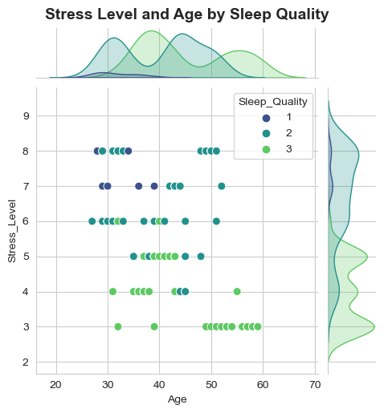

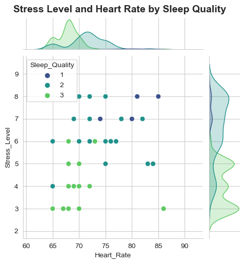


發現壓⼒程度越⼤，睡眠品質越差；⼼率越低，睡眠品質越⾼；壓⼒、⼼率與睡眠品質呈顯著負相關。

```python
import seaborn as sns
import matplotlib.pyplot as plt

sns.catplot(data=dataset, x='Sleep_Quality', hue='BMI_Category', kind='count', height=3, aspect=1.5, palette='viridis', alpha=0.7)
plt.title('Relationship between Sleep Quality and BMI Category', fontsize=12, fontweight='bold')
plt.xlabel('Sleep Quality')
plt.ylabel('Count')
plt.show()

sns.catplot(data=dataset, x='Sleep_Quality', hue='Daily_Steps_Group', kind='count', height=3, aspect=1.5, palette='viridis', alpha=0.7)
plt.title('Relationship between Sleep Quality and Daily Steps Group', fontsize=12, fontweight='bold')
plt.xlabel('Sleep Quality')
plt.ylabel('Count')
plt.show()
```

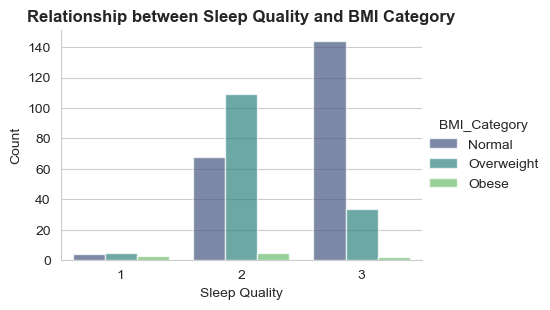


發現 BMI 落在正常範圍的群體，睡眠品質⾼的⼈較多；⽽ BMI 落在過重以上的群體，睡眠品質普通的⼈較多。每⽇步數達 7500 的群體，睡眠品質都偏⾼；⽽每⽇步數不到 5000 的群體，睡眠品質低的⼈較多。

## 機器學習特徵重要性分析：隨機森林分類 Random Forest

**預測 Sleep Quality 的特徵重要性分析**

```python
dataset_without_id = encode_dataset.drop(columns=['Person ID'])

numerical_data = dataset_without_id.select_dtypes(include=['int64', 'float64'])

X = numerical_data.drop(columns=['Sleep_Quality'])
y = dataset_without_id['Sleep_Quality']

rf_regressor = RandomForestRegressor()
rf_regressor.fit(X, y)

feature_importances = rf_regressor.feature_importances_

feature_importance_df = pd.DataFrame({'Feature': X.columns, 'Importance': feature_importances})

feature_importance_df = feature_importance_df.sort_values(by='Importance', ascending=False)

plt.figure(figsize=(10, 10))
plt.barh(feature_importance_df['Feature'], feature_importance_df['Importance'], color='teal')
plt.xlabel('Importance')
plt.ylabel('Feature')
plt.title('Feature Importance Analysis (Random Forest)', fontweight='bold', fontsize=20)
plt.gca().invert_yaxis()
plt.show()
```

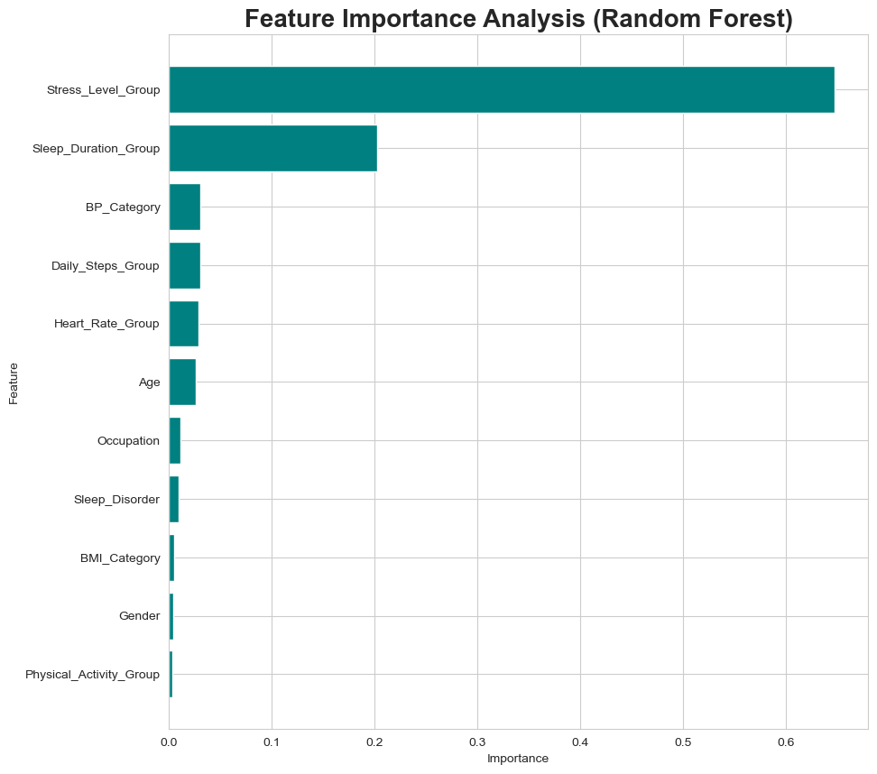


從以上特徵分析中發現，相較於其他變量，顯著重要的特徵為 Stress Level 和 Sleep Duration。那對 Stress Level 最重要的特徵是什麼呢？

**預測 Sleep Level 的特徵重要性分析**

```python
dataset_without_id = encode_dataset.drop(columns=['Person ID'])

numerical_data = dataset_without_id.select_dtypes(include=['int64', 'float64'])

X = numerical_data.drop(columns=['Stress_Level_Group'])
y = dataset_without_id['Stress_Level_Group']

rf_regressor = RandomForestRegressor()
rf_regressor.fit(X, y)

feature_importances = rf_regressor.feature_importances_

feature_importance_df = pd.DataFrame({'Feature': X.columns, 'Importance': feature_importances})

feature_importance_df = feature_importance_df.sort_values(by='Importance', ascending=False)

plt.figure(figsize=(10, 10))
plt.barh(feature_importance_df['Feature'], feature_importance_df['Importance'], color='teal')
plt.xlabel('Importance')
plt.ylabel('Feature')
plt.title('Feature Importance Analysis (Random Forest)', fontweight='bold', fontsize=20)
plt.gca().invert_yaxis()
plt.show()
```

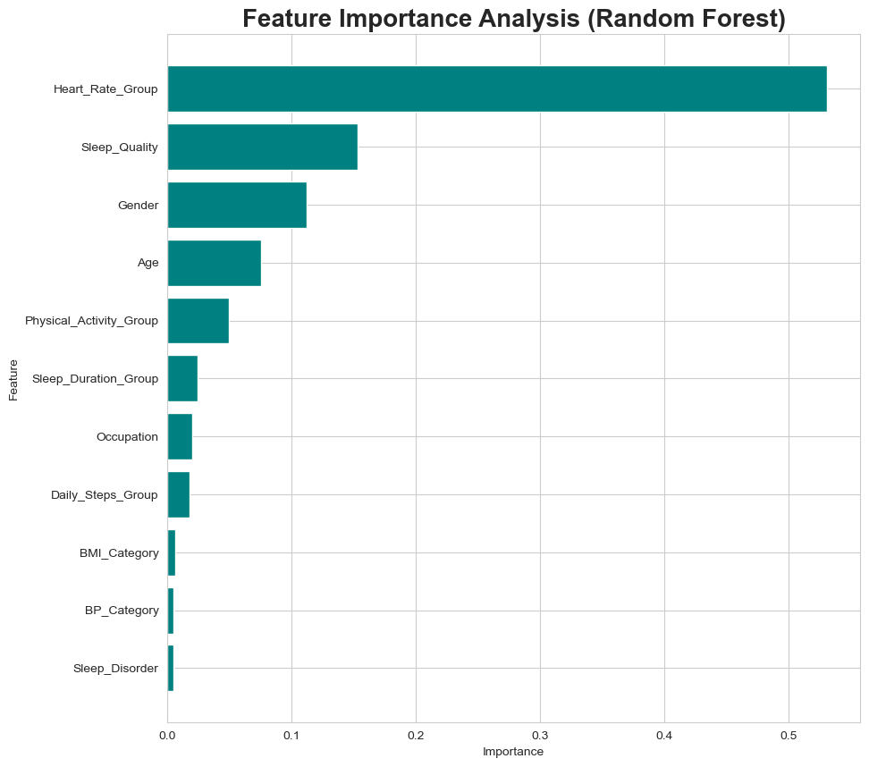

從以上特徵分析中發現，對 Stress Level 顯著重要的特徵為 Heart Rate。

## 提升睡眠品質

綜上分析，識別出影響睡眠品質的三⼤關鍵因素為睡眠時⾧、壓⼒程度和⼼率 ，那麼在個⼈因素（性別、年齡、職業）不變的情況下，若想要提升睡眠品質到達某⼀程度，該如何提升睡眠品質？

**文獻支撐**

1. Bilal A. Chaudhry , et al.，The Relationship between Sleep Duration and Metabolic Syndrome Severity Scores in Emerging Adults.（2023）
   此研究表明短睡眠時間（<7 小時）和長睡眠時間（>9 小時）都與較高的代謝症候群嚴重程度評分相關，這表明 ​​ 最佳睡眠時間對於代謝健康和整體健康至關重要。
2. Mirjam Ekstedt , et al.，Microarousals during sleep are associated with increased levels of lipids, cortisol, and blood pressure.（2004）
   高壓力水平一直與較差的睡眠品質有關。壓力會激活下丘腦-垂體-腎上腺（HPA) 軸，增加皮質醇水平，從而擾亂睡眠模式並降低睡眠效率。
3. Yongbin Li , et al.，Research on the relationship between physical activity, sleep quality, psychological resilience, and social adaptation among Chinese college students: A cross-sectional study.（2023）
   研究發現體育活動可以顯著改善大學生的心理恢復力和社會適應，從而改善睡眠質量，表明參與體育活動可能有助於減少這個人群的睡眠問題
4. Hanne K J Gonnissen , et al.，Sleep duration, sleep quality and body weight: Parallel developments. (2013)
   研究討論了睡眠質量和體重之間的關係，強調睡眠短或受干擾與肥胖的增加有關，且青春期和成年期的 BMI 指數變化與睡眠時長的變化相反相關，表明更好的睡眠可能有助於管理體重。
5. Heart rate variability, sleep and sleep disorders.（2012）
   研究調查了失眠患者的心率變異性（HRV) 與睡眠品質之間的關係。結論是較低的 HRV（表示較高的心率）與較差的睡眠品質相關。
6. Amirreza Sajjadieh , et al.，The Association of Sleep Duration and Quality with Heart Rate Variability and Blood Pressure.（2020）
   這項研究評估了青少年心率變異性和睡眠效率之間的關聯。研究結果表明，較高的心率與較低的睡眠效率有關，導致睡眠品質較差。

## 分析結果

1. **分析結果顯示，影響睡眠品質的三大關鍵因素為：睡眠時長、壓力程度、心率，且三者之間存在互相影響的關係。另外分析結果也顯示睡眠品質會影響壓力程度。**
2. **本研究提出兩個方法改善睡眠品質，首先是直接調整睡眠的時間長度，不要過短或過長，在一個適合的範圍內；其次是透過運動（身體活動）調整身體素質（BMI）和心血管健康，進而排解壓力、穩定心率，才能夠進一步提高睡眠品質。**
